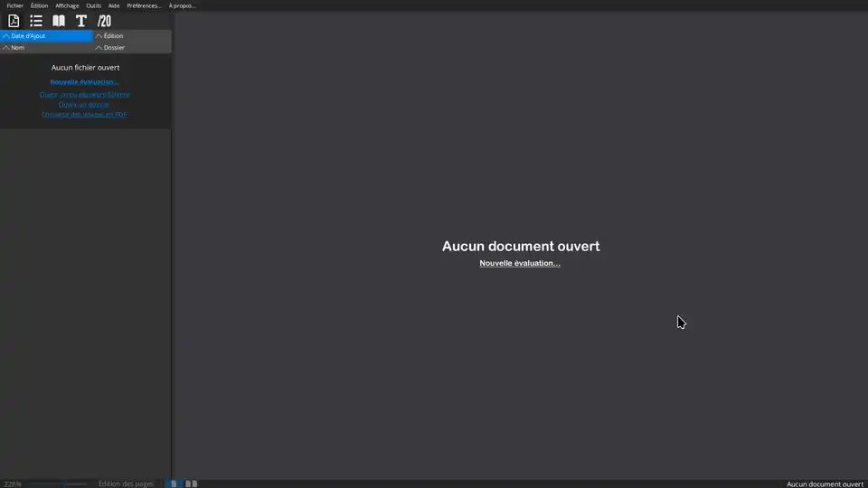
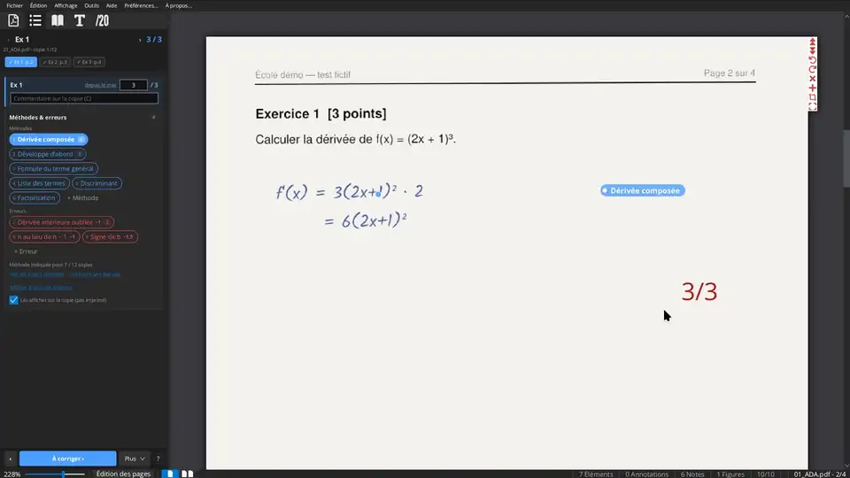
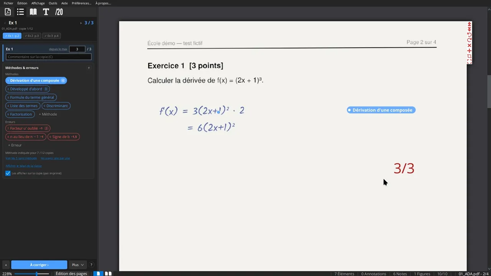

<p align="center">
  <br>
  <b>Corrigo</b><br>
  Correction de copies scannées, exercice par exercice
</p>

[English version](README.md)

Corrigo est une application de bureau pour corriger des copies scannées : annoter les PDF, noter exercice par exercice
avec des commentaires réutilisables, étiqueter les méthodes et les erreurs de chaque copie (elles peuvent donner ou
retirer des points), les voir pour toute la classe, et rendre les copies en PDF ou via Moodle. Les annotations ne
modifient jamais les PDF d'origine.

- [Guide d'utilisation](docs/guide-utilisateur/README.md)
- [User guide (English)](docs/user-guide/README.md)

## Pourquoi Corrigo

**Par rapport à PDF4Teachers.** Corrigo est construit dessus et garde ce qu'il fait (affichage, textes, formules,
dessins, images, export). La différence principale est la correction par exercice avec une grille critériée : chaque
exercice a ses méthodes et ses erreurs, qui donnent ou retirent des points, on corrige un exercice sur toutes les copies
avant le suivant, et un bilan de la classe montre les erreurs qui reviennent. Corrigo part aussi du scan de la classe
pour créer une évaluation, calcule les notes sur l'échelle de votre choix, et est plus rapide à l'usage.

**Par rapport à la correction dans Moodle.** L'interface de correction de Moodle va copie par copie, dans le
navigateur. Avec Corrigo, les copies papier sont scannées d'un bloc et découpées, on corrige la question 3 de toutes
les copies à la suite, on voit quelles erreurs reviennent dans la classe, les notes viennent de votre barème, et tout
reste sur votre ordinateur.

[Détails dans le guide d'utilisation](docs/guide-utilisateur/00-pourquoi-corrigo.md).

## En images

**1. Une nouvelle évaluation à partir du scan de la classe** : les élèves dans l'ordre du scan, un PDF par élève, le
barème avec ses exercices, ses pages et ses critères.

[](docs/videos/new-evaluation-fr.mp4)

**2. Corriger un exercice sur toutes les copies** : pointer une erreur et appuyer sur `#`, ses points comptent ; un
commentaire pour l'élève ; la méthode de la copie suivante ; les commentaires déjà écrits sont proposés.

[](docs/videos/grading-fr.mp4)

**3. La classe** : méthodes et erreurs avec la moyenne des points, toutes les copies ayant une erreur côte à côte, une
note personnelle avec capture d'écran, revue des copies une à une, étiquetage des copies sans les ouvrir.

[](docs/videos/class-fr.mp4)

Cliquez sur une animation pour la vidéo complète. Les copies des vidéos et des captures sont fictives (élèves portant
des noms de mathématiciens).

## Installation

Téléchargez l'installateur de votre système dans les [versions](https://github.com/nathan-ed/Corrigo/releases). Java
est inclus : rien d'autre à installer.

- **Windows** : `Corrigo-Windows-<version>.msi` (installateur) ou `Corrigo-Windows-<version>.zip` (portable, à
  décompresser puis lancer).
- **macOS** : `Corrigo-MacOSX-<version>.dmg` (Intel) ou `Corrigo-MacOSX-AArch64-<version>.dmg` (Apple Silicon : M1 et
  suivants). Glissez Corrigo dans *Applications*.
- **Linux** : `Corrigo-Linux-<version>.deb` (Debian, Ubuntu et dérivés : `sudo apt install ./Corrigo-Linux-<version>.deb`).

Les installateurs sont construits automatiquement à chaque version. Vos réglages sont conservés lors des mises à jour.

### Dernière version depuis le code source

Pour essayer les derniers changements, avant qu'ils soient dans une version, Corrigo peut aussi se lancer depuis le
code source (Java 21 et Git requis) :

```
git clone https://github.com/nathan-ed/Corrigo.git
cd Corrigo
./gradlew run        # Windows : gradlew.bat run
```

Pour mettre à jour : `git pull` dans ce dossier, puis relancer.

Vos réglages sont conservés dans `~/.local/share/Corrigo` (Linux), `~/Library/Application Support/Corrigo` (macOS) ou
`%APPDATA%\Corrigo` (Windows) ; les annotations et données de chaque évaluation sont à côté de ses copies. Le premier
démarrage reprend les réglages de PDF4Teachers s'il était installé.

## Basé sur PDF4Teachers

Corrigo est une version modifiée de [PDF4Teachers](https://github.com/ClementGre/PDF4Teachers), de Clément Grennerat
et des contributeurs de PDF4Teachers, sous licence Apache 2.0. Il n'est ni conçu ni approuvé par les auteurs de
PDF4Teachers. Voir [NOTICE](NOTICE).

## Licence

Apache License 2.0 : voir [LICENSE](LICENSE) et [NOTICE](NOTICE).
