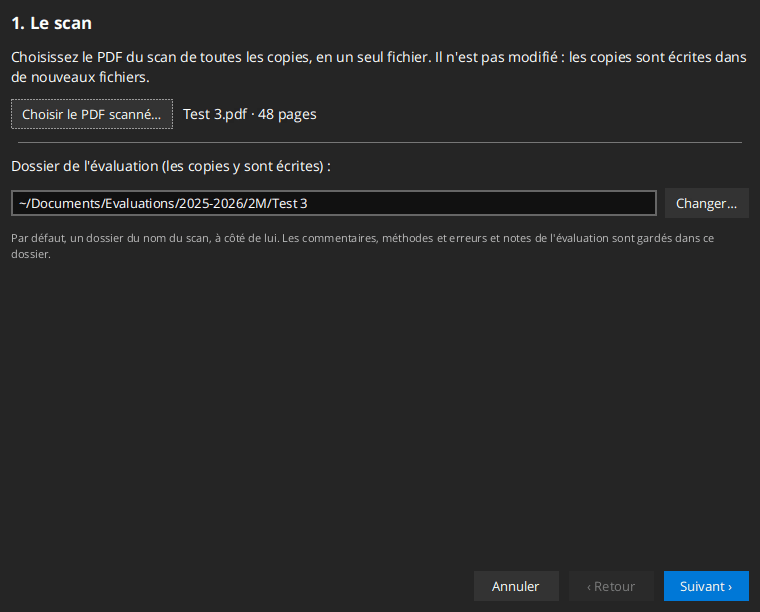
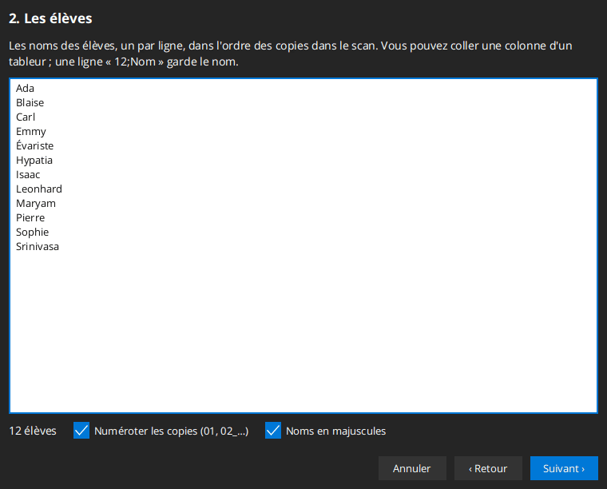
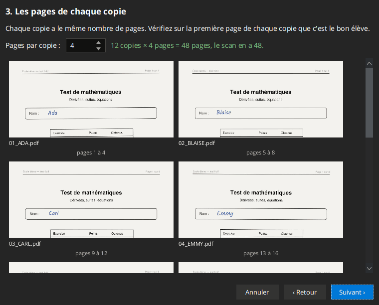
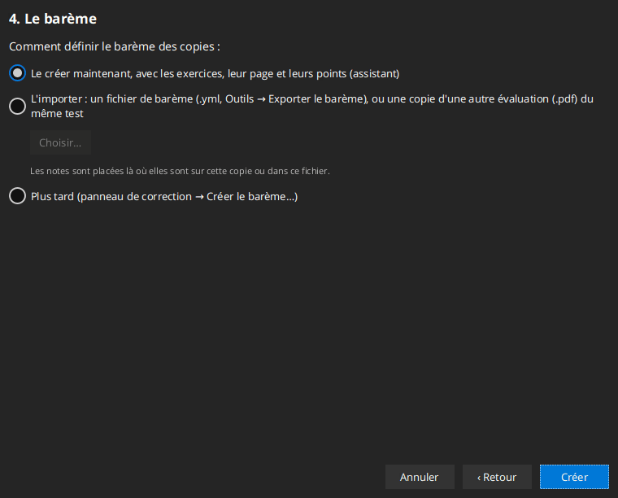

# Premiers pas

## La fenêtre

- **Barre de menus** : Fichier, Édition (annuler/rétablir), Affichage (panneaux latéraux, plein écran), Outils, Aide,
  Préférences….
- **Panneaux latéraux** : des onglets à gauche (et à droite) du document. Chaque onglet est une icône :

  | Icône | Onglet | Sert à |
  |---|---|---|
  | Feuille PDF | **Fichiers** | la liste des copies en cours |
  | Liste | **Correction** | le panneau de correction : un exercice à la fois |
  | Livre | **Mes notes** | vos notes personnelles (jamais sur les copies) |
  | **T** | **Textes** | les annotations textuelles et les listes de commentaires |
  | **/20** | **Barème** | le barème et les exports des notes |

  Les onglets **Dessin** (dessins, figures, images) et **Compétences** sont masqués pour le moment.

  Glissez un onglet par son icône pour le mettre dans l'autre panneau. **Affichage** permet de masquer les panneaux,
  de rétablir leur largeur ou de mettre tous les onglets du même côté.
- **Document** : la copie ouverte. `Ctrl` + molette pour zoomer ; clic droit sur une page pour les actions rapides
  (une méthode ou une erreur ici, une note personnelle, une capture avec une note, la prochaine note, les textes
  favoris).
- **Barre du bas** : zoom, mode **Édition des pages**, vue en colonne/en grille, nombre d'éléments de la copie, total,
  état de la sauvegarde.

## Une nouvelle évaluation à partir du scan

**Fichier → Nouvelle évaluation…** (ou le bouton du panneau de correction vide) crée les copies d'une évaluation à
partir du scan de toutes les copies, en un seul PDF :

1. **Le scan** : choisissez le PDF. Il n'est pas modifié. Les copies vont dans un nouveau dossier du nom du scan, à
   côté de lui (vous pouvez en choisir un autre). Un dossier qui a déjà des copies n'est jamais écrasé : l'assistant
   en demande un autre.
2. **Les élèves** : leurs noms, un par ligne, dans l'ordre des copies dans le scan (collez une colonne d'un tableur si
   vous voulez ; une ligne `12;Nom` garde le nom). Les copies sont numérotées (`01_`, `02_`…) et en majuscules, les
   deux au choix : `07_DUPONT.pdf`.
3. **Les pages de chaque copie** : devinées à partir du scan et du nombre d'élèves. Le haut de la première page de
   chaque copie est affiché avec son nom de fichier : vérifiez que c'est le bon élève. L'assistant indique quand le
   scan a trop peu ou trop de pages.
4. **Le barème** : le créer maintenant avec l'assistant (voir [Créer le barème](03-correction.md#créer-le-barème)),
   l'importer (un barème exporté `.yml`, ou une copie du même test dans une autre évaluation, dont les notes sont
   placées aux mêmes endroits), ou plus tard.

Les copies sont ensuite listées dans l'onglet Fichiers, et la première s'ouvre dans le panneau de correction au
premier exercice.

## Ouvrir les copies

- **Fichier → Ouvrir un ou plusieurs fichiers** (`Ctrl+O`) ajoute des PDF à l'onglet Fichiers ; **Fichier → Ouvrir un
  dossier** (`Ctrl+Maj+O`) ajoute tous les PDF d'un dossier.
- Double-cliquez sur un fichier pour l'ouvrir. `Ctrl+Alt+←/→` ouvre le fichier précédent/suivant de la liste.
- Clic droit sur un fichier : ouvrir, renommer, créer une copie, retirer de la liste (le fichier reste sur le disque),
  supprimer.
- Triez la liste avec les boutons du haut (date d'ajout, édition, nom, dossier).
- Renommez les copies depuis l'application (**Fichier → Renommer le fichier PDF** ou le menu du fichier) : les
  annotations suivent. Renommée avec l'explorateur de fichiers, une copie les perd (voir **Outils → Éditions des
  documents du même nom** pour les récupérer).

### Organiser une évaluation

Gardez un dossier par évaluation, qui ne contient que ses copies, un PDF par élève. Nommez les copies avec un numéro et
le nom de l'élève, par exemple `07_DUPONT.pdf` : le nom après le tiret bas identifie l'élève pour l'export Moodle.
Tout ce que l'application sait de l'évaluation (commentaires, méthodes et erreurs, notes personnelles) est enregistré
dans ce dossier, dans un sous-dossier caché `.pdf4teachers` : le dossier peut donc être déplacé ou sauvegardé en entier.

Les copies scannées se préparent avec les outils PDF : couper un gros scan en un fichier par élève, convertir des
photos en PDF, tourner ou réordonner les pages (voir [Annoter les copies](02-annoter.md#outils-pdf)).

## Sauvegarder

Les annotations sont enregistrées automatiquement quand vous changez de copie ou fermez l'application (préférence
**Sauvegarder automatiquement**), et toutes les quelques minutes si **Sauvegarder régulièrement** est activé.
**Fichier → Sauvegarder l'édition** (`Ctrl+S`) enregistre tout de suite. La barre du bas affiche « Sauvegardé ! ».

Les annotations de `copie.pdf` sont enregistrées à côté d'elle, dans un fichier caché `.copie.pdf.yml` (préférence
**Enregistrer les éditions à côté des fichiers PDF**, recommandée), sinon dans le dossier de données de l'application.

**Les changements de pages sont différents** : tourner, déplacer, ajouter ou supprimer des pages, les marges, le
recadrage et les livrets modifient le fichier PDF lui-même, immédiatement.

## Exporter

**Fichier → Exporter (Régénérer le PDF)** (`Ctrl+E`) écrit un nouveau PDF avec toutes les annotations ; **Fichier →
Tout exporter** (`Ctrl+Maj+E`) le fait pour tous les fichiers de la liste. Les PDF d'origine ne changent pas. Voir
[Rendre les copies](06-export.md).

## Annuler

`Ctrl+Z` / `Ctrl+Maj+Z` annulent et rétablissent les changements des annotations du document. En mode **Édition des
pages**, ils annulent les changements de pages.
