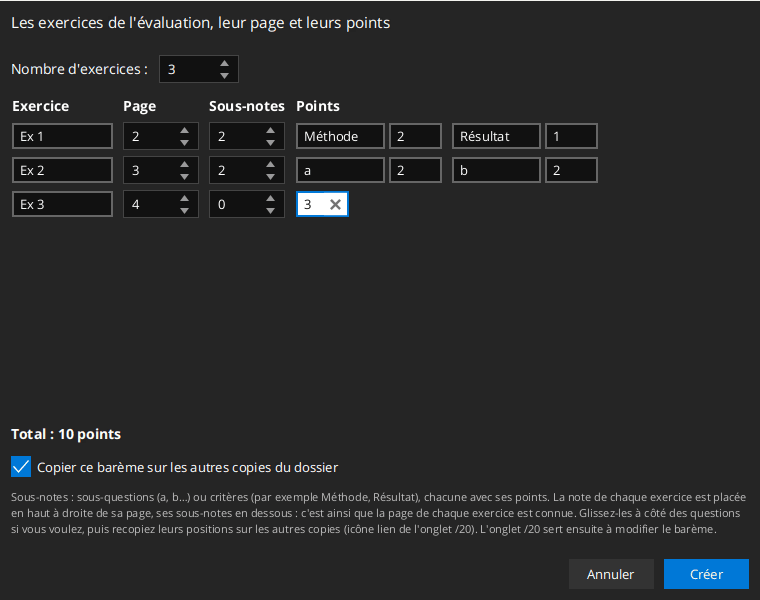
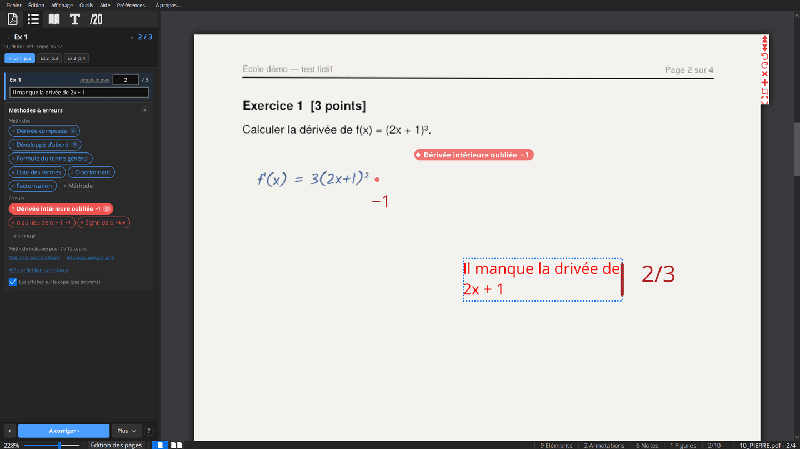
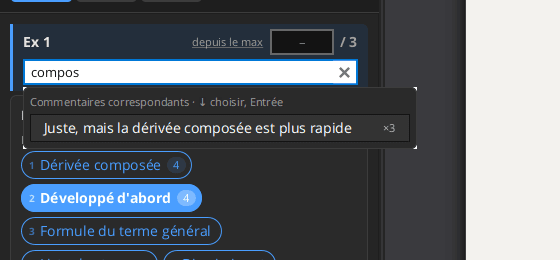

# Barème et correction

## Créer le barème

Sur une copie sans barème, le panneau de correction propose **Créer le barème…** :

1. le nombre d'exercices ;
2. pour chaque exercice, son nom, sa page, et ses points, ou ses sous-notes : sous-questions (a, b, c… par défaut) ou
   critères que vous nommez (par exemple Méthode, Résultat), chacune avec ses points ;
3. **Copier ce barème sur les autres copies du dossier** (coché s'il y a d'autres copies).

La note de chaque exercice est placée en haut à droite de sa page, ses sous-notes en dessous : c'est ainsi que
l'application connaît la page de chaque exercice. Glissez les notes à côté des questions si vous voulez, puis recopiez
leurs positions sur les autres copies (icône lien de l'onglet /20). L'onglet /20 sert ensuite à modifier le barème.

## Le barème (onglet /20)

Le barème est un arbre : le total, les exercices, et leurs sous-questions, chacun avec ses points. Les exercices sont
le premier niveau sous le total (l'application les appelle *exercices* partout : panneau de correction, commentaires,
méthodes et erreurs).

- **Le construire** : le **+** d'une note ajoute une sous-note ; `Ctrl+G` ajoute une note au même niveau que celle
  sélectionnée. `Tab` et `Entrée` passent du nom aux points.
- **Saisir les points** dans le champ de la note, ou clic droit : **Mettre à 0**, **Attribuer tous les points**,
  **Réinitialiser**. Un double-clic la met à 0. `Ctrl+N` sélectionne la prochaine note à saisir.
- Les parents se calculent tout seuls. Une note nommée `Bonus…` n'est pas comptée dans le maximum, seulement dans le
  résultat.
- **Ramener sur** : exprimer le total sur une autre échelle (par exemple /20).
- **Placer les notes sur la page** : chaque note est écrite là où vous la mettez sur la copie (glissez-la). Clic
  droit → cacher les notes non saisies.
- **Verrou** (cadenas) : empêche de modifier le barème par erreur pendant la correction.
- **Polices et Couleurs des Notes** (roue dentée) : police, couleur, préfixe de chaque niveau, afficher le nom, cacher
  une note, la cacher quand elle a tous les points.
- **Copier le barème sur les autres copies** (icône de lien) : sur toutes les copies de la liste ou sur celles du même
  dossier. Laissez **Copier la position des notes** coché pour que les notes soient au même endroit sur chaque copie.
- **Exporter / importer un barème** dans un fichier : **Outils → Exporter/Importer des éditions/barèmes**.

Un barème suisse typique commence par un exercice « PNF » (présentation), puis Q1…Qn.

## Les exercices et leurs pages

Corrigez exercice par exercice, pas copie par copie : le panneau de correction montre un exercice (`‹ ›`,
`Alt+↑` / `Alt+↓`, ou ses boutons « Ex 1 p.2 »…), et tant qu'il est ouvert, changer de copie ouvre la copie suivante à
la page de cet exercice. `Ctrl+Alt+Maj+←/→` ou `Alt+Page préc./suiv.` gardent la page (ou vont à la page de
l'exercice), `Alt+1…9` va à la page de l'exercice 1…9.

La page d'un exercice est celle où sont ses notes sur la copie. Quand les notes de tous les exercices sont sur la même
page (par exemple dans un tableau en première page), le panneau l'indique : indiquez la page de chaque exercice avec
**Plus ▾ → Pages des exercices…**, ou glissez les notes sur les pages de leurs exercices.

## Le panneau de correction (icône liste)

Le panneau montre l'exercice à corriger, ses sous-notes, et tout ce qu'il faut pour le corriger vite. `Ctrl+Maj+G` y
va depuis n'importe où.

**En-tête** : l'exercice et ses points, `‹ ›` pour l'exercice précédent/suivant, la copie (par exemple
« 07_DUPONT.pdf · copie 7/24 ») et un bouton par exercice pour aller à sa page (✓ quand il est corrigé sur cette copie).
Le panneau suit la page que vous lisez.

**Une section par sous-note**, celle en cours mise en évidence :

- le champ des points et le maximum ; sur la sous-note en cours, « depuis le max » / « depuis 0 » indique si les
  points des méthodes et erreurs comptent à partir du maximum ou de zéro (cliquez pour changer) ;
- **Commentaire sur la copie (C)** : le commentaire de cette sous-note, écrit à côté de sa note pendant que vous
  tapez. Vider le champ l'enlève.

Les autres sous-notes tiennent sur une ligne ; leur commentaire, s'il y en a un, s'affiche en une ligne de texte
(cliquez dessus pour le modifier).

**Commentaire général (G)** : le commentaire pour tout l'exercice, pour les exercices qui ont des sous-notes (un
exercice sans sous-notes n'a qu'un commentaire). Il est écrit sous la dernière sous-note, sur la page de l'exercice.
Chaque exercice a un seul commentaire général : modifier le champ le modifie sur la copie, il n'est jamais ajouté deux
fois.

Pendant que vous modifiez un commentaire, il est sélectionné sur la copie, comme dans l'onglet Textes, et la copie
défile jusqu'à lui s'il n'est pas visible.

**Méthodes & erreurs** : voir [Méthodes et erreurs](04-methodes-et-erreurs.md).

**Bas du panneau** : **‹** / **À corriger ›** ouvrent la copie précédente/suivante où cet exercice n'est pas
entièrement corrigé ; **Plus ▾** : **Position de la note** / **Calculer les notes** (voir [Notes](#notes-1-à-6)), **Pages des exercices…** ;
**?** affiche les touches.

### Clavier dans le panneau

Quand le panneau a le clavier (cliquez dans son espace vide, ou `Ctrl+Maj+G`) :

| Touche | Action |
|---|---|
| `1`…`9` | mettre la n-ième méthode ou erreur de la carte sur la copie (ses points comptent sur la sous-note en cours) |
| `⌫` Retour arrière | enlever la dernière méthode ou erreur mise sur la copie pour cet exercice |
| `0` | 0 point à la sous-note en cours |
| `=` ou `+` | tous les points |
| `↑` `↓`, `Entrée` / `Maj+Entrée` | sous-note précédente / suivante |
| `←` `→` | copie précédente / suivante |
| `Tab` | le champ des points de la sous-note en cours (`Maj+Tab` : son commentaire) |
| `C` | le champ de commentaire de la sous-note en cours |
| `G` | le commentaire général |
| `Z` / `Maj+Z` | copie non corrigée suivante / précédente |
| `Suppr` | enlever le commentaire sélectionné sur la copie (par exemple celui qu'on vient de placer) |
| `Échap` | rendre le clavier au document |

Dans les champs :

- **Tab / Maj+Tab** parcourent tout l'exercice : points → commentaire → points de la sous-note suivante → … →
  commentaire général, et retour. Les points sont appliqués quand vous quittez le champ.
- **Entrée** dans un champ de points l'applique et passe à la sous-note suivante. Dans un champ de commentaire, il
  écrit le commentaire et passe à la sous-note suivante (depuis le commentaire général : à la copie non corrigée
  suivante). **Ctrl+Entrée** écrit le commentaire là où vous cliquez sur la page au lieu d'à côté de la note.
- **Échap** annule la modification du champ.

### Commentaires proposés

Quand un champ de commentaire reçoit le clavier, ou pendant que vous tapez, les commentaires de l'évaluation sont
proposés en dessous :

1. d'abord ceux déjà écrits **dans ce champ** (cette sous-note) sur d'autres copies,
2. puis ceux de **cet exercice**,
3. puis tous les autres (leur exercice est indiqué à droite, avec le nombre de copies qui les utilisent).

Taper les filtre (chaque mot, sans tenir compte des accents ni des majuscules). `↓` en choisit un, `Entrée` ou un clic
l'écrit sur la copie. Les propositions viennent des commentaires écrits sur les copies du dossier, depuis le panneau
comme en texte libre.

## Points des méthodes et erreurs

Les points se donnent ou s'enlèvent avec les [méthodes et erreurs](04-methodes-et-erreurs.md#points-et-commentaire) :
une erreur peut enlever des points (par exemple « Erreur de signe −1 »), une méthode peut en ajouter, et chaque fois
qu'elle est mise sur une copie, elle écrit ses points (et son commentaire) à côté de la note. La sous-note est alors
calculée à partir de son maximum (ou de 0, voir « depuis le max ») et de ces points. Une valeur tapée à la main
l'emporte ; clic droit sur une note → **Calculer depuis les méthodes et erreurs** pour revenir à la valeur calculée.
Quand il ne reste plus de méthode ou d'erreur avec des points sur une sous-note, elle reprend la valeur qu'elle avait
avant.

(Les « commentaires notés » des versions précédentes sont remplacés par les méthodes et erreurs. Ceux déjà sur des
copies continuent de compter.)

## Notes (1 à 6)

Les notes sont sur l'échelle suisse de 1 à 6 : **obtenu / total × 5 + 1, arrondi au demi le plus proche**.

1. **Position de la note** : cliquez dessus, puis cliquez sur la page où va la note. La position sert pour toutes les
   copies.
2. **Calculer les notes** : écrit la note sur chaque copie entièrement corrigée de la liste des fichiers. Si aucune
   position n'a été indiquée, elle est demandée d'abord.

La fenêtre de résultat liste les notes, les copies pas entièrement corrigées, et les copies pour lesquelles un demi-point
ou un point de plus changerait la note (double-clic pour en ouvrir une). Les notes sont aussi disponibles en colonne
dans l'[export vers un tableur](06-export.md#notes-dans-un-tableur).
