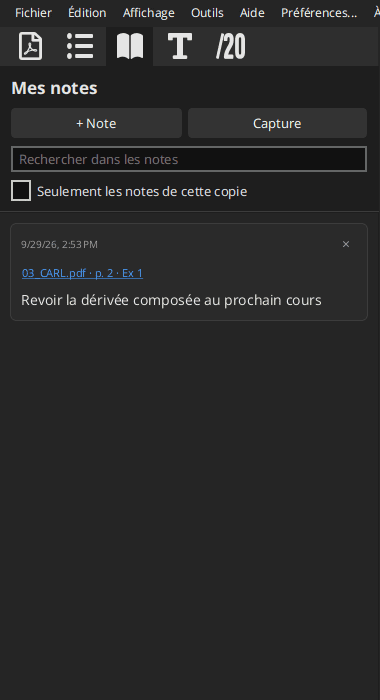
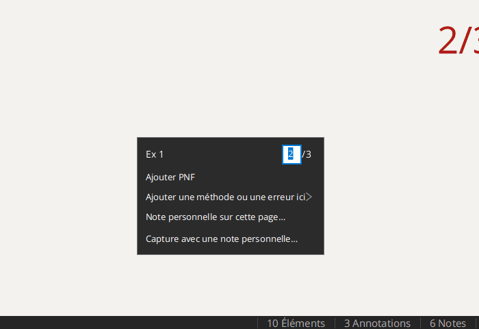

# Notes personnelles

Les notes personnelles sont pour vous seulement : elles ne sont jamais écrites sur les copies. Servez-vous-en pour tout
ce que vous voulez retenir pendant la correction (« revoir le barème de Q3 avec un collègue », « a copié sur son
voisin ? », « bon exemple à montrer en classe »).

- `Ctrl+Maj+N` : nouvelle note, depuis n'importe où. Tapez-la, `Entrée` pour l'enregistrer, `Maj+Entrée` pour aller à
  la ligne.
- `Ctrl+Maj+S` : note avec capture. Glissez sur la copie pour choisir une zone (un clic prend toute la page), puis
  écrivez la note. `Échap` annule.
- Clic droit sur une page : **Note personnelle sur cette page…** ou **Capture avec une note personnelle…**.
- Clic droit sur un aperçu de copie (les fenêtres qui montrent les copies d'un commentaire, d'une méthode ou d'une
  erreur) : **Note personnelle sur cette copie…**, ou **Note personnelle avec cet aperçu…** (la partie de la page
  affichée), sans ouvrir la copie.
- Onglet **Mes notes** (icône livre) : toutes les notes, les plus récentes d'abord, avec la copie et la page où elles
  ont été prises.
  - **Rechercher dans les notes** ; **Seulement les notes de cette copie**.
  - **Aller à la copie** l'ouvre à cette page.
  - Cliquez sur une capture pour l'agrandir ; cliquez sur le texte d'une note pour le modifier ; supprimez une note
    depuis son menu.

Les notes prises sur une copie sont enregistrées dans le dossier de son évaluation (`.pdf4teachers/notes.yml`, les
captures dans `.pdf4teachers/notes/`). Les notes prises sans copie ouverte sont gardées dans le dossier de données de
l'application.

