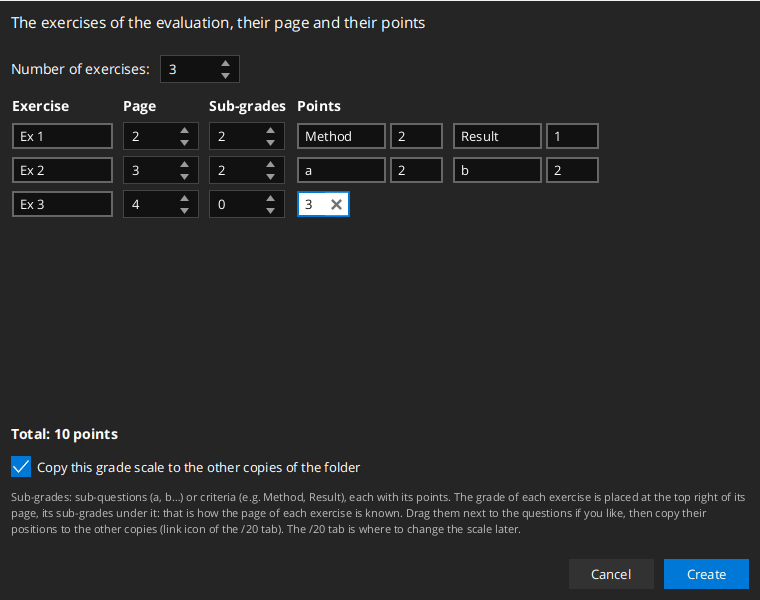
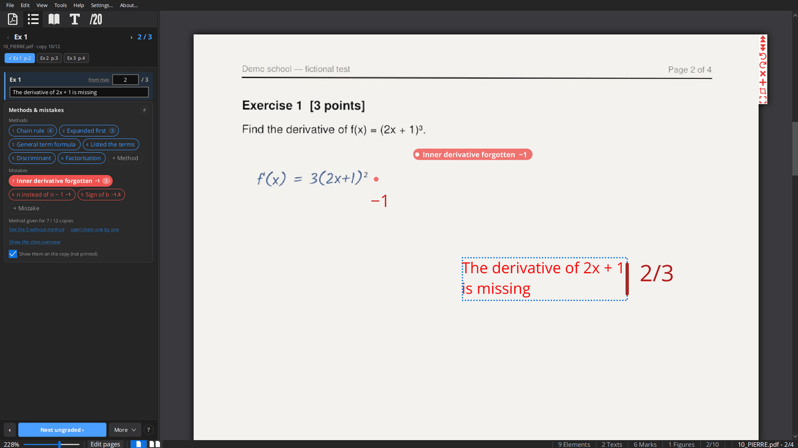
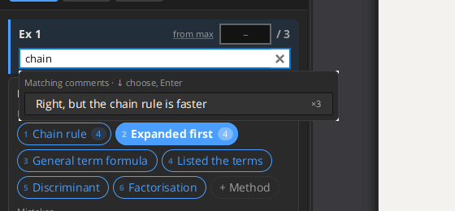
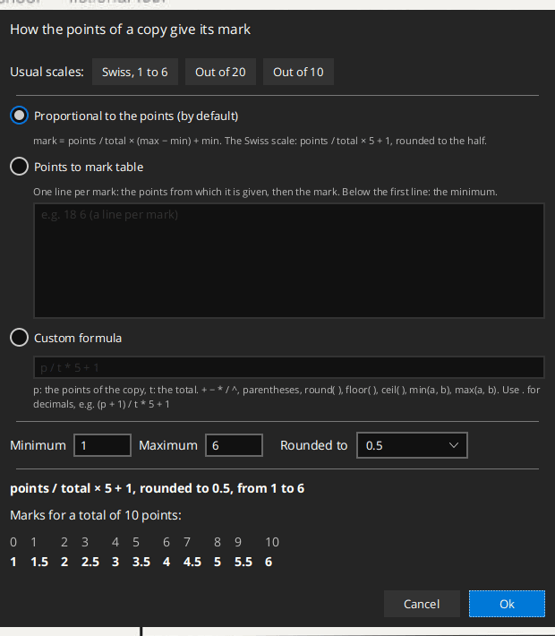

# Grade scale and grading

## Creating the grade scale

On a copy without grade scale, the grading panel offers **Create the grade scale…**:

1. the number of exercises;
2. for each exercise, its name, its page, and its points, or its sub-grades: sub-questions (a, b, c… by default) or
   criteria you name yourself (e.g. Method, Result), each with its points;
3. **Copy this grade scale to the other copies of the folder** (checked when there are other copies).

The grade of each exercise is placed at the top right of its page, its sub-grades under it: that is how the app
knows the page of each exercise. Drag the grades next to the questions if you like, then copy their positions to the
other copies (link icon of the /20 tab). Change the scale later in the /20 tab.

## The grade scale (/20 tab)

The grade scale is a tree: the total, the exercises, and their sub-questions, each with its points. The exercises are
the first level under the total (the app calls them *exercises* everywhere: grading panel, comments, methods and
mistakes).

- **Build it**: the **+** of a grade adds a sub-grade under it; `Ctrl+G` adds a grade at the same level as the
  selected one. `Tab` and `Enter` move between the name and the points fields.
- **Enter the points** in the grade's field, or right-click it: **Set to 0**, **Set maximum mark**, **Reset**. A
  double-click sets it to 0. `Ctrl+N` selects the next grade to enter.
- The parents are summed automatically. A grade named `Bonus…` is not counted in the maximum, only in the result.
- **Scale to**: express the total on another scale (e.g. /20).
- **Place the grades on the page**: each grade is written where you put it on the copy (drag it). Right-click → hide
  the unfilled grades.
- **Lock** (padlock icon): prevents changing the scale by mistake while grading.
- **Fonts and colors** (gear icon): font, color, prefix of each level, show the name, hide a grade, hide it when full.
- **Copy the scale to the other copies** (link icon): to all the listed copies or to those of the same folder. Keep
  **Copy marks position** checked so that the grades are at the same place on every copy.
- **Export / import a grade scale** as a file: **Tools → Export/Import edits or marking scales**.

A typical Swiss scale starts with a "PNF" exercise (presentation), then Q1…Qn.

## Exercises and their pages

Correct exercise by exercise, not copy by copy: the grading panel shows one exercise (`‹ ›`, `Alt+↑` / `Alt+↓`, or
its buttons "Ex 1 p.2"…), and while it is open, switching copy opens the next copy at the page of that exercise.
`Ctrl+Alt+Shift+←/→` or `Alt+Page Up/Down` keep the page (or go to the exercise page), `Alt+1…9` jumps to the page of
exercise 1…9.

The page of an exercise is where its grades are on the copy. When the grades of all the exercises are on the same page
(e.g. in a table on the first page), the panel says so: set the page of each exercise with **More ▾ → Pages of the
exercises…**, or drag the grades onto the pages of their exercises.

## The grading panel (list icon)

The panel shows the exercise being graded, its sub-grades, and everything to grade it quickly. `Ctrl+Shift+G` focuses
it from anywhere.

**Header**: the exercise and its points, `‹ ›` for the previous/next exercise, the copy (e.g. "07_DUPONT.pdf · copy
7/24") and a button per exercise to jump to its page (✓ when graded on this copy). The panel follows the page you are
reading.

**One section per sub-grade**, the active one highlighted:

- the points field and the maximum; on the active sub-grade, "from max" / "from 0" says whether the points of the
  methods and mistakes count down from the maximum or up from zero (click to switch);
- **Comment on the copy (C)**: the comment of this sub-grade, written next to its grade while you type.
  Emptying the field removes it.

The inactive sub-grades take one line; their comment, if any, is shown as a line of text (click it to edit it).

**General comment (G)**: the comment for the whole exercise, for exercises with sub-grades (an exercise without
sub-grades has one comment only). It is written under the last sub-grade, on the page of the exercise. Each exercise
has one general comment: editing the field changes it on the copy, it is never added twice.

While you edit a comment, it is selected on the copy, as in the Texts tab, and the copy scrolls to it if it is out of
sight.

**Methods & mistakes**: see [Methods and mistakes](04-methods-and-mistakes.md).

**Footer**: **‹** / **Next ungraded ›** open the previous/next copy where this exercise is not fully graded;
**More ▾**: **Mark position** / **Compute marks** / **Marks scale…** (see [Marks](#marks)), **Pages of the exercises…**; **?** shows the keys.

### Keyboard in the panel

When the panel has the keyboard (click its empty space, or `Ctrl+Shift+G`):

| Key | Action |
|---|---|
| `1`…`9` | put the n-th method or mistake of the card on the copy (its points count on the active sub-grade) |
| `⌫` Backspace | remove the last method or mistake put on the copy for this exercise |
| `0` | 0 points for the active sub-grade |
| `=` or `+` | full points |
| `↑` `↓`, `Enter` / `Shift+Enter` | previous / next sub-grade |
| `←` `→` | previous / next copy |
| `Tab` | the points field of the active sub-grade (`Shift+Tab`: its comment) |
| `C` | the comment field of the active sub-grade |
| `G` | the general comment |
| `Z` / `Shift+Z` | next / previous ungraded copy |
| `Delete` | remove the comment selected on the copy (e.g. the one just placed) |
| `Esc` | give the keyboard back to the document |

In the fields:

- **Tab / Shift+Tab** go through the whole exercise: points → comment → points of the next sub-grade → … → general
  comment, and back. The points are applied when you leave the field.
- **Enter** in a points field applies it and goes to the next sub-grade. In a comment field it writes the comment and
  goes to the next sub-grade (from the general comment: to the next ungraded copy). **Ctrl+Enter** writes the comment
  where you click on the page instead of next to the grade.
- **Esc** cancels the edit of the field.

### Comment suggestions

When a comment field gets the focus, or while you type, the comments of the evaluation are suggested under it:

1. first those already written **in this field** (this sub-grade) on other copies,
2. then those of **this exercise**,
3. then all the others (their exercise is shown on the right, with the number of copies using them).

Typing filters them (every word, accents and case ignored). `↓` selects one, `Enter` or a click writes it on the copy.
The suggestions come from the comments written on the copies of the folder, whether from the panel or as free texts.

## Points of the methods and mistakes

Points are given or removed with the [methods and mistakes](04-methods-and-mistakes.md#points-and-comment): a mistake
can remove points (e.g. "Sign error −1"), a method can add some, and each time it is put on a copy it writes its
points (and its comment) next to the grade. The sub-grade is then computed from its maximum (or from 0, see "from
max") and these points. A value typed by hand wins over them; right-click a grade → **Compute from the methods and
mistakes** to go back to the computed value. When no method or mistake with points is left on a sub-grade, it gets
back the value it had before.

(The "scored comments" of the previous versions are replaced by the methods and mistakes. Those already on copies keep
counting.)

## Marks

By default, marks are on the Swiss 1–6 scale: **obtained / total × 5 + 1, rounded to the nearest half**. Each
evaluation can have its own **marks scale** (More ▾ → **Marks scale…**):

- **Proportional to the points** (the default): points / total × (max − min) + min. Set the minimum and maximum (1 to
  6, 0 to 20, 1 to 10…).
- **Points to mark table**: one line per mark, the points from which it is given then the mark (`18 6`, `16 5.5`…).
  Below the first line: the minimum.
- **Custom formula** of `p` (the points) and `t` (the total): e.g. `(p + 1) / t * 5 + 1`. `+ − * / ^`, parentheses,
  `round`, `floor`, `ceil`, `min(a, b)`, `max(a, b)`; a dot for decimals.

**Rounded to**: 1, 0.5 (to the half), 0.25, 0.1, or not rounded; the mark is always kept between the minimum and the
maximum. **Usual scales** sets Swiss (1 to 6, to the half), out of 20 or out of 10 in one click. The window shows the
marks for the total of the grade scale while you change it. The scale is saved in the evaluation folder
(`.pdf4teachers/marks.yml`).

1. **Mark position**: click it, then click on the page where the mark goes. The position is used for every copy.
2. **Compute marks**: writes the mark on every fully graded copy of the files list. If no position was set, it asks
   for one first.

The result window lists the marks, the copies that are not fully graded, and the copies for which half a point or one
point more would change the mark (double-click to open one). It names the marks scale used, with a link to change it. The marks are also available as a column in the
[spreadsheet export](06-export.md#marks-to-a-spreadsheet).
