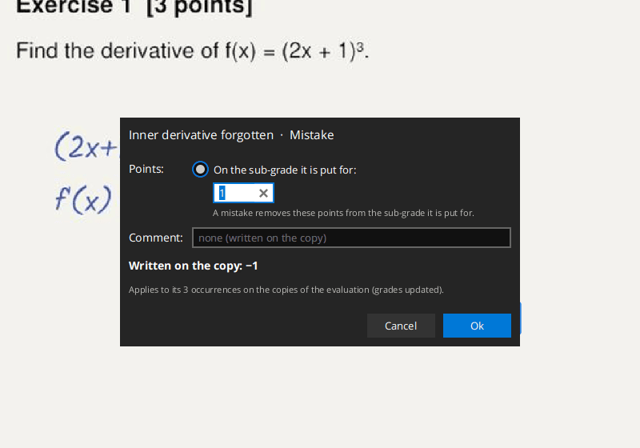
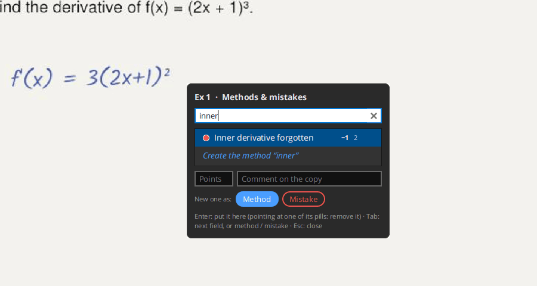
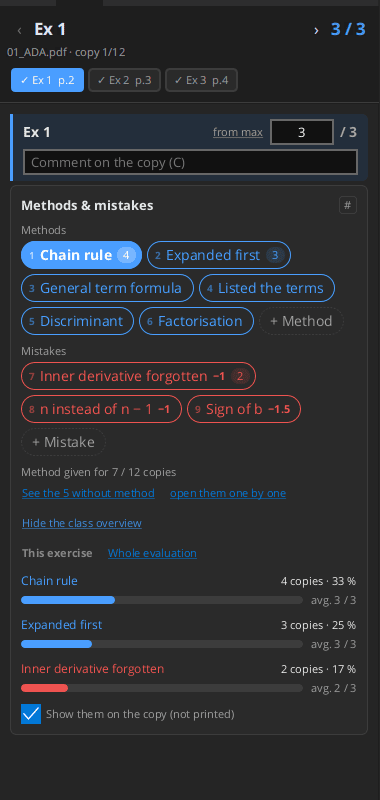
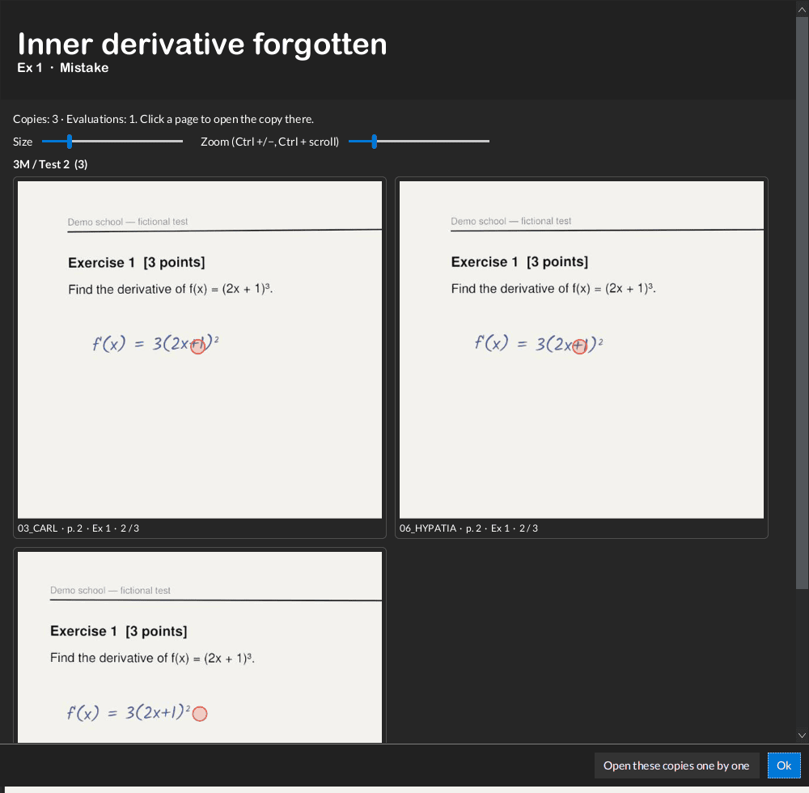
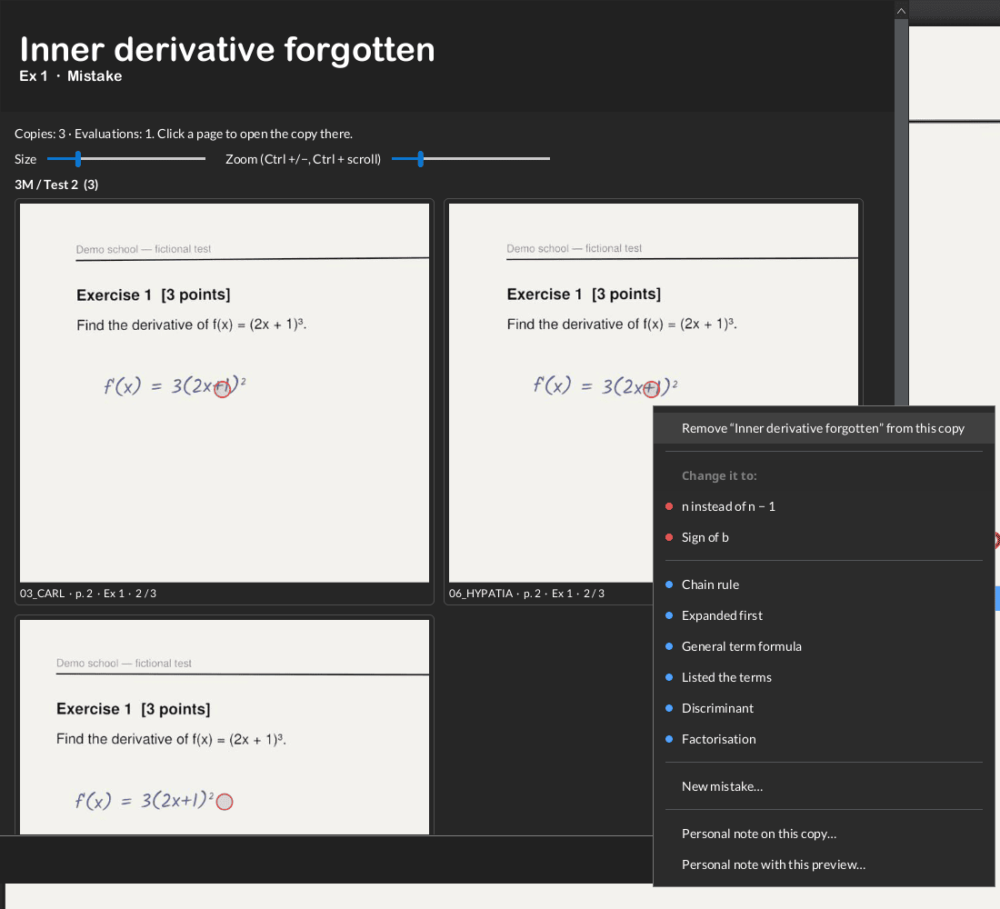
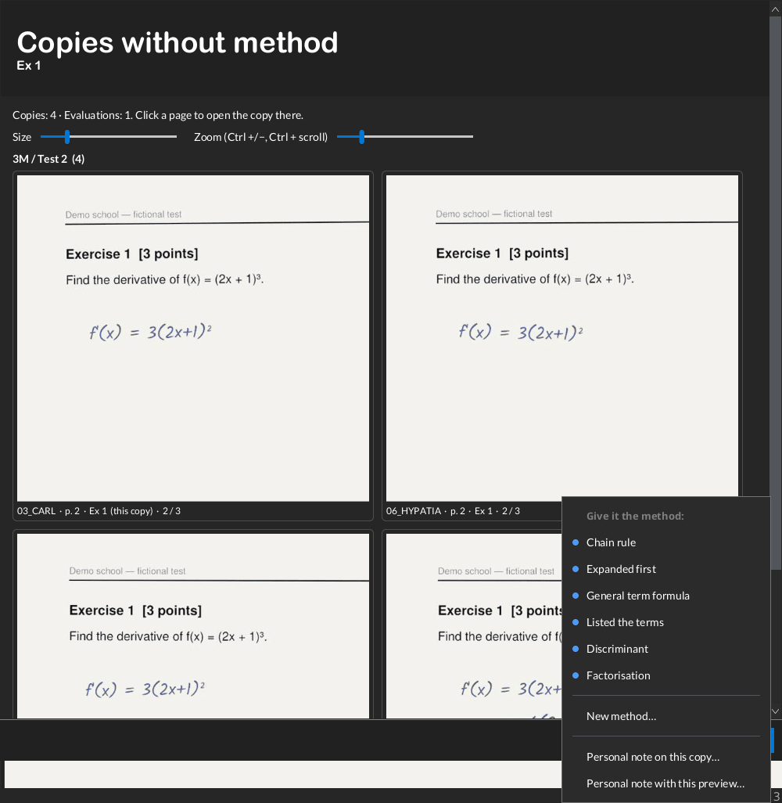
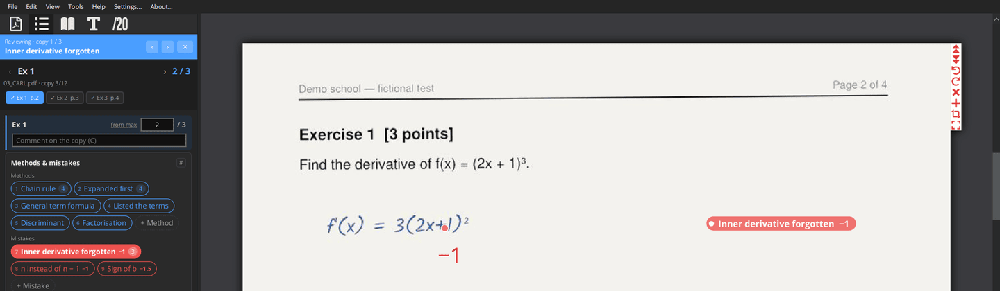

# Methods and mistakes

While grading, tag each copy with the **method** the student used and the **mistakes** they made. You then see, for
the class, which methods were used, how often each mistake happened and how many points those students got, and you
can look at all the copies with a given method or mistake side by side. A method or mistake can also **give or remove
points** and write a **comment** on the copy: it then replaces the "scored comments" of earlier versions. Its name is
never written on the copies.

## Tags

- There are two kinds: **methods** (blue) and **mistakes** (red).
- A tag is created in an exercise, but can be used in **any exercise**: "Sign error" can be tagged in Q2 and in Q4.
- When grading an exercise, its own tags (created for it, or already used in it) come first, then all the others.
  The first nine are numbered: keys `1`…`9`.
- A copy can have several methods and mistakes in an exercise, and **the same one several times**: each time is an
  occurrence, with its own pill and, if it has points, its own points (two sign errors cost twice the points).

## Points and comment

Optional, for each method or mistake: right-click it → **Points and comment…**, or give them when creating it.

- **Points**: a mistake removes them, a method adds them. They count on **the sub-grade it is put for**: the one whose
  grade is closest to where you point on the copy, or else the sub-grade active in the grading panel.
- Or **on chosen sub-grades**: one amount per sub-grade of the exercise (e.g. a +1, b +2). Each occurrence then counts
  on all of them, whatever sub-grade is active.
- **Comment**: written on the copy with the points.

What is written on the copy, next to the spot or to the grade: the points only (`−1`), the comment with the points
(`Check the sign (−1)`), or the comment only when there are no points; nothing when it has neither (the pill only).
The dialog shows it while you type. Changing the points or the comment updates all the copies that have it, open or
not, and their grades. A grade typed by hand stays until a method or mistake with points is put on its sub-grade; when
none is left, it gets back that value.

## Tagging a copy

**From the card** (Methods & mistakes, in the grading panel): click a tag to add it to the copy for this exercise, click
it again to remove it (all its occurrences in this exercise). **Shift+click** adds it once more. The number on a tag is
how many copies have it in this exercise (click the number to see them); "×2" means the copy has it twice.

**+ Method** / **+ Mistake** create a new one and add it to the copy: type the name, then `Tab` for its points and
its comment (both optional), `Enter`.

**At a spot of the copy**: point at the place on the page, press `#` (or `Ctrl+Shift+M`). A small window opens at the
mouse:

- type to search, or type a new name: fields for its **points** and **comment** appear (`Tab` to reach them). Points
  typed with a sign choose the kind: `-1` makes a mistake, `+1` a method; without a sign, the Method / Mistake buttons
  decide. `Sign error -1` typed as the name works too;
- `↑` `↓` to choose, `Enter` to put it here. Pointing at one of its dots removes that occurrence instead;
- `Esc` closes it.

**Keys**: in the grading panel, `1`…`9` put the n-th tag of the card (points on the active sub-grade) and `Backspace`
removes the last one put. With the mouse on the copy, `1`…`9` put the n-th tag at the mouse. Right-click on a page →
**Add a method or a mistake here** does the same from a menu.

Right-click a tag in the card for **Points and comment…**, to show its copies, open them one by one, rename it, make it a
method/mistake, or delete it (you are warned if copies use it; what it wrote on them is removed and their grades are
computed again). Deleting the text it wrote on a copy removes that occurrence.

## Pills on the copy

The tags of the open copy are shown on its pages as small pills, **on screen only** (never printed or exported):

- a tag put with `#` shows as a pill in the left margin, at the height of the spot, with a dot on the exact spot
  (hover the pill to see a line to its dot);
- a tag added from the card shows under the grade of the exercise.

There is one pill per occurrence, with its points. Drag a pill to put it elsewhere on the page (it stays there), or drag
its dot to move the spot. Right-click a pill (or
its dot) to remove it, put it back in the margin, change it to another tag, or hide all the pills. The checkbox
**Show them on the copy (not printed)** at the bottom of the card shows or hides them.

## The class

Under the tags, the card shows how many copies have a method for this exercise, with:

- **See the N without method**: previews of the copies not classified yet;
- **open them one by one**: see [Reviewing copies](#reviewing-copies-one-by-one).

**Show the class overview** lists the tags with, for each one, the number and share of copies. Choose:

- **This exercise**: the tags of the exercise, with the average points of these copies on the exercise (e.g. do the
  students who expanded get fewer points than those who used the chain rule?);
- **Whole evaluation**: every tag used in the evaluation, the copies having it in any exercise, and in which
  exercises (e.g. "Q2 ×5 · Q4 ×3").

Click a row to see its copies.

## Previews of the copies of a tag

Clicking a tag's number, a row of the overview, or **Show the copies** opens previews of all the copies with the tag,
zoomed around the spot where it was put, with the points of each copy on the exercise. Use the **Size** and **Zoom**
sliders (or `Ctrl` + scroll, `Ctrl +/-`) to compare many copies at once.

- **Click** a preview to open that copy at that page.
- **Right-click** a preview to change the copy **without opening it**:
  - remove the tag from this copy;
  - change it to another tag (or a new one), at the same spot;
  - on the "without method" previews: give it a method.

  The preview is then dimmed with a note ("→ Chain rule", "Removed"); right-click it again to undo.
- **Open these copies one by one** starts a review of these copies (below).

## Reviewing copies one by one

A review goes through a chosen set of copies: the copies with a tag (in this exercise, or in all the exercises), or
the copies without method.

Start it from the right-click menu of a tag (**Open these copies one by one**), from the previews window, or with
**open them one by one** under "See the N without method". The first copy opens at the tag's spot and a blue banner
appears at the top of the grading panel: "Reviewing · copy 2 / 7" and the tag's name.

While the banner is shown, `‹` `›` in the banner and all the previous/next copy keys (`←` `→`, `Ctrl+Alt+←/→`…) only
go through these copies, each one opened at the tag's spot. A message says when you reach the first or last one.
`✕` stops the review.

Typical uses: check that all the "Sign error" copies lost the same points, classify the copies without method, or
re-read all the copies with an unexpected method.

## Where tags are stored

In the evaluation folder, `.pdf4teachers/tags.yml`: the tags, and for each copy which tag, in which exercise, and
where. Tags are kept by copy file name: rename copies from the app before tagging, not afterwards.
